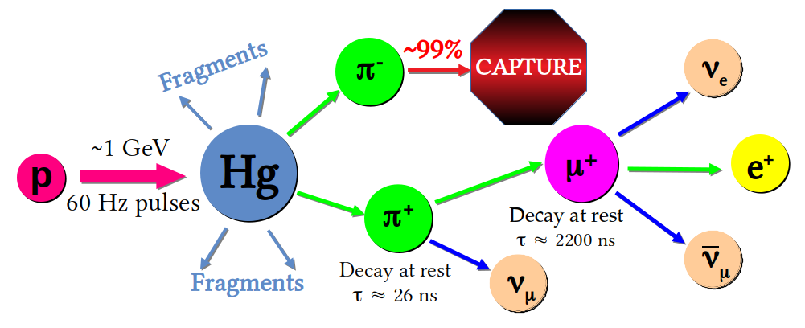

> "Welcome to the nerd lab." -- GoGo Tomago

Physics is broken down into several subfields, and I classify as an
"experimental nuclear/particle physicist".  We use fancy technologies
to observe interactions between particles and matter, and use our
observations to better understand the properties of both the matter
and the particles!  For me, I am fascinated by the hands-down
_weirdest_ particle around: the neutrino.  Neutrinos don't frequently
interact -- there's billions of neutrinos that pass through your
thumbnail _every second_ just from the Sun, but on average, only 1
neutrino will interact within your whole body _in your lifetime_.  And
yet, despite their "ghostly" nature, they're existence and limited
interactions have helped shape the universe!

I work with the [COHERENT](https://sites.duke.edu/coherent/)
collaboration and study coherent elastic neutrino-nucleus scattering
(CEvNS), a process by which an incoming neutrino hits a target nucleus
and causes it to recoil as a whole.  Think about throwing a ping-pong
ball at a bowling ball; we study the ping-pong ball by investigating
the different reactions of the bowling ball!  CEvNS will cause the
nucleus (our "bowling ball") to recoil a smidge.  When this happens in
a scintillator, energy will be released to the material surrounding
the nucleus as light, and we can look for this light with a
photomultiplier tube.  Other types of detectors could look for moving
charges or thermal changes to identify CEvNS interactions.

My specific contributions focus on studying the neutrino and neutron
fluxes (the number of particles per area per second) incident on our
detectors.  The neutrino flux might be a little more obvious: we want
to know how many neutrinos will hit our detectors so that we can
calculate how many events we should see.  The neutron flux is just as
important, because we're looking for a small nuclear recoil -- a
neutron can cause this too!  We need to know how many neutrons will be
in our detectors so that we don't accidentally count them as part of
our signal.

Our neutrino flux estimates come from simulating the neutrino
production at the Spallation Neutron Source (SNS) at Oak Ridge
National Laboratory in Tennesee.  The SNS accelerates packets of
protons to 1 GeV, then smashes them into a liquid mercury target.
Think about the break shot in a pool game.  You accelerate the cue
ball, aim at the rack, and knock all the individual balls away from
the initially organized setup.  At the SNS, the proton is the cue ball
and the nucleus of a single mercury atom is the rack, but our solids
and stripes are unstable fragments of an atomic nucleus that decay
into neutrinos: 

While my research focuses on how we get neutrinos from the SNS, the
interests of COHERENT and the CEvNS community are broad and diverse.
Precision measurements of CEvNS give us insight into the properties of
neutrinos, helps us better understand the physics happening in the atomic nucleus,
contributes to our understanding of supernova core collapse, and
provides an understanding of the "neutrino floor" needed for the next
generation of WIMP dark matter searches.

In addition to neutrinos and CEvNS, I'm also interested in detector
response studies and the considerations involved with constructing a
new experiment.  I've worked on simulations of the MARS detector,
which monitors the beam-related neutron background from the SNS.