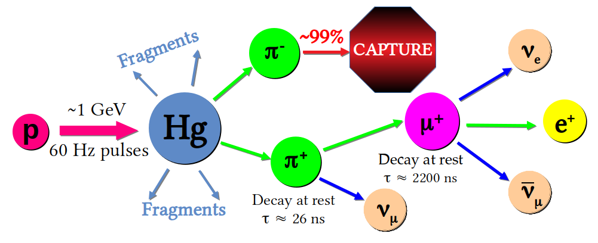

Our neutrino flux estimates come from simulating the neutrino
production at the Spallation Neutron Source (SNS) at Oak Ridge
National Laboratory in Tennesee.  The SNS accelerates packets of
protons to 1 GeV, then smashes them into a liquid mercury target.
Think about the break shot in a pool game.  You accelerate the cue
ball, aim at the rack, and knock all the individual balls away from
the initially organized setup.  At the SNS, the proton is the cue ball
and the nucleus of a single mercury atom is the rack, but our solids
and stripes are unstable fragments of an atomic nucleus that decay
into neutrinos: 

